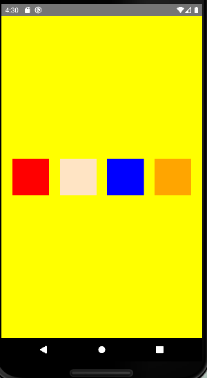
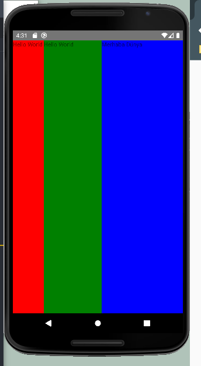
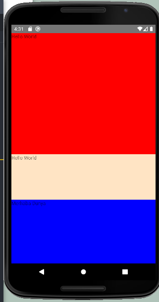
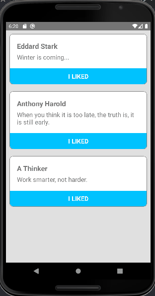

<h1 style="text-align:center">React Native Style, Custom Component</h1>

<h3 style="text-align:center">Style</h3>

    
    
    

<h3 style="text-align:center">Custom Component/onPress Events</h3>

    

